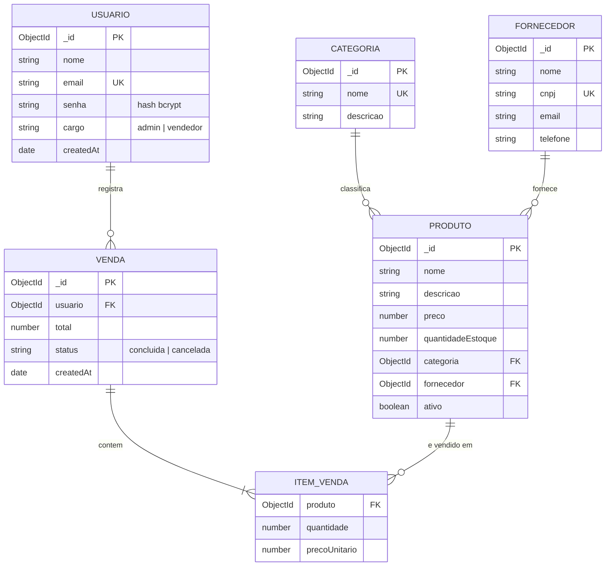

# Diagrama de Entidade-Relacionamento (DER)

O banco é MongoDB (não relacional), mas as coleções abaixo se relacionam
por referência (`ObjectId` + `ref`), da mesma forma que chaves
estrangeiras em um banco relacional. O diagrama a seguir usa a notação
`erDiagram` do Mermaid (renderiza automaticamente no GitHub).

## Observações sobre a modelagem

- `ITEM_VENDA` é um **sub-documento embutido** dentro de `VENDA` (não é
  uma coleção separada no MongoDB), pois os itens só fazem sentido no
  contexto da venda a que pertencem e são sempre lidos em conjunto.
- `precoUnitario` é copiado do produto no momento da venda, para que o
  histórico de vendas não mude se o preço do produto for alterado depois.
- `email` (Usuário) e `cnpj` (Fornecedor) são únicos (`unique: true`).
- `nome` (Categoria) também é único, para evitar categorias duplicadas.
